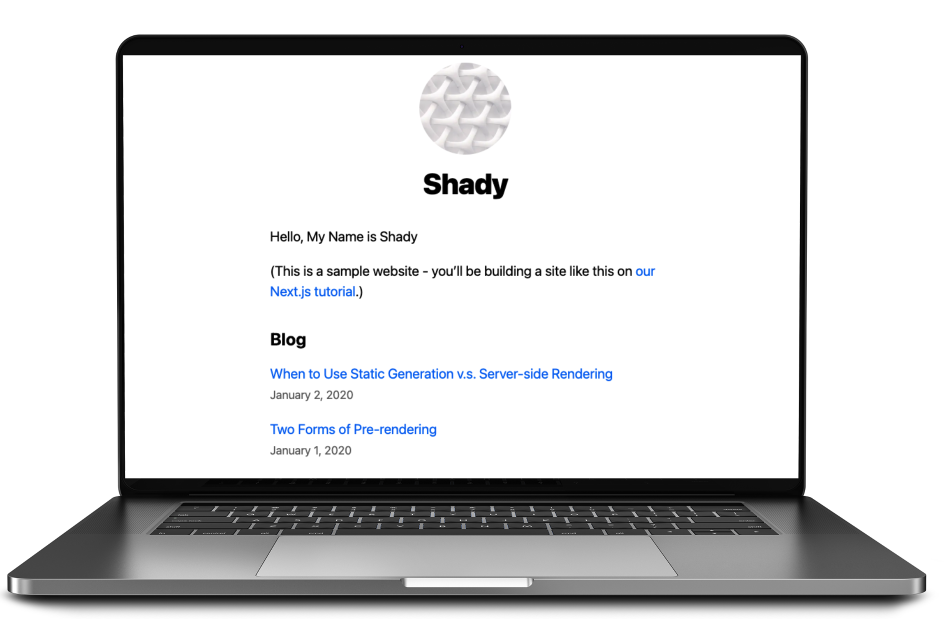

# Nextjs Playground

## PartI - Next Blog

Create a blog example with [Next.js](https://nextjs.org/) and [React](https://reactjs.org/), powered by [vercel](https://vercel.com/).

* Starter template: [Learn Next.js](https://github.com/vercel/next-learn/tree/master/basics/learn-starter).
* Demo Website: [vercel powered blog site](https://next-blog-orpin-six.vercel.app/)

## Part II - API Server

Implement API endpoint with nextjs and Prisma, with PostgreSQL.

### Prisma

Prisma is an open-source ORM that dramatically simplifies data mdoeling,
migrations, and data access for SQL databases in Node.js and TypeScript. Next.js
blurs the lines between client and server. It supports pre-rendering pages at
build time(SSG) or request time(SSR). Prisma is the perfect companion if you
need to work with a database in a Next.js app.

## References

* [nextjs tutorial](https://nextjs.org/learn/basics/create-nextjs-app)
* [react](https://reactjs.org/)
* [prisma](https://www.prisma.io/)

